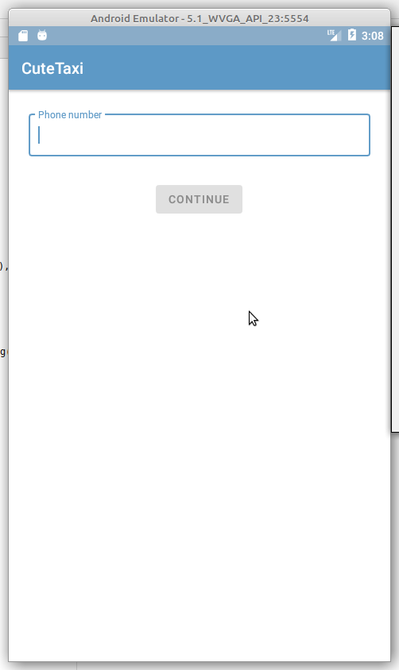
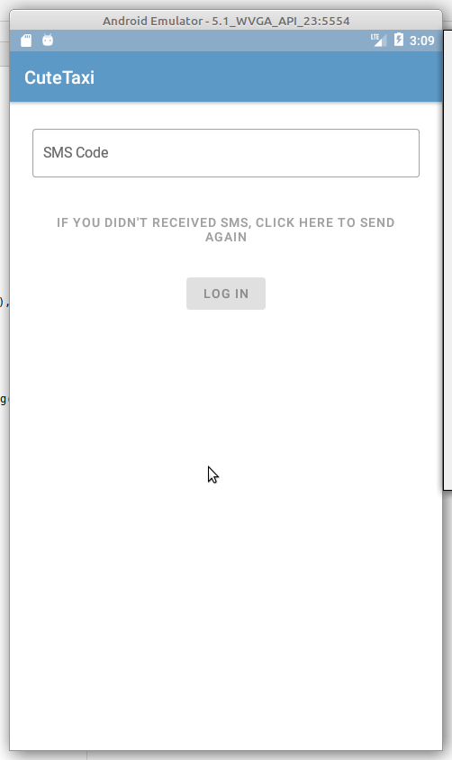
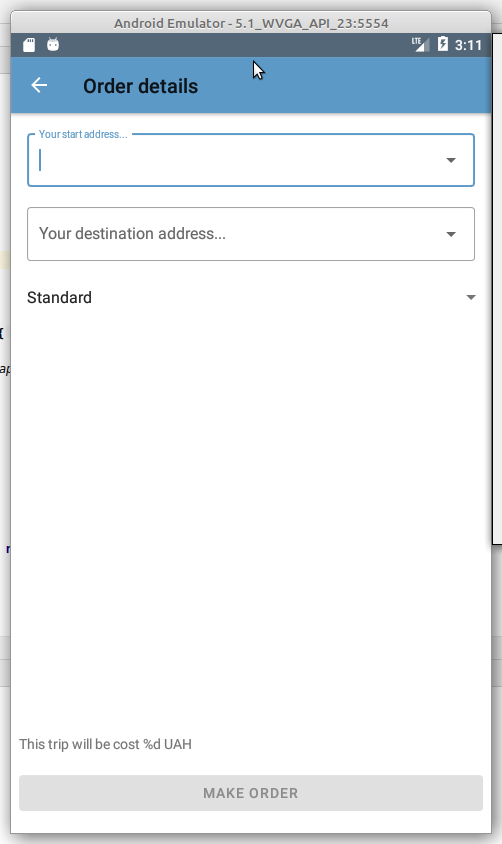
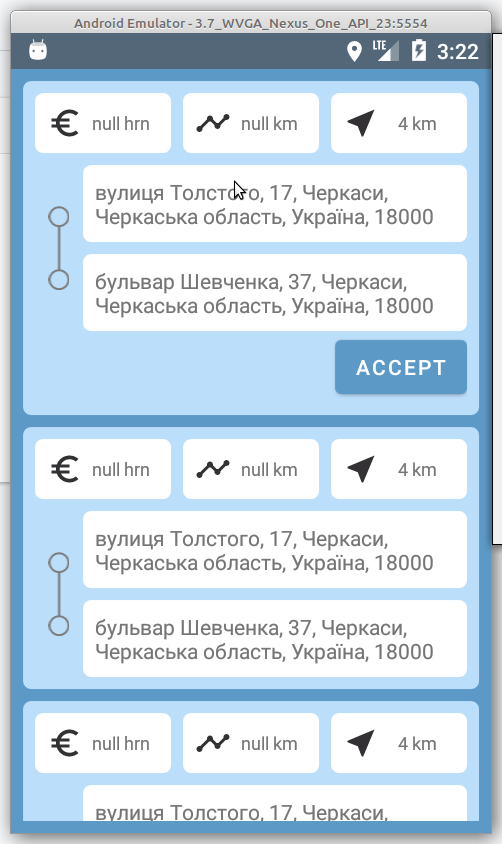
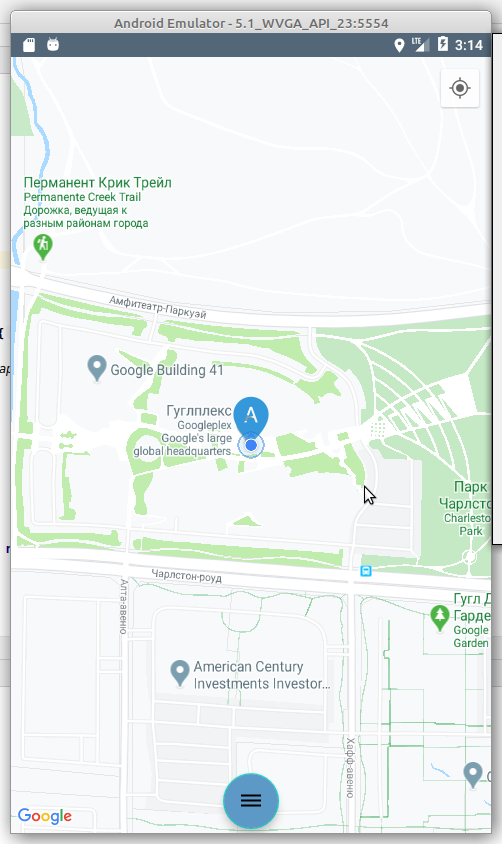
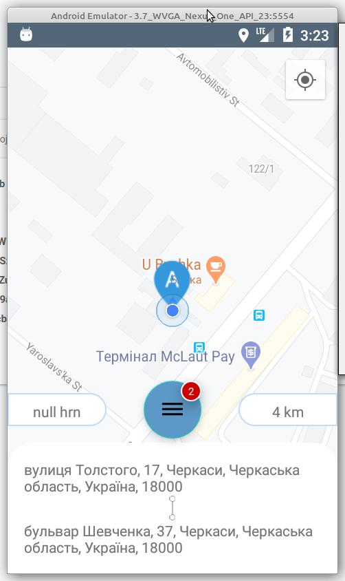
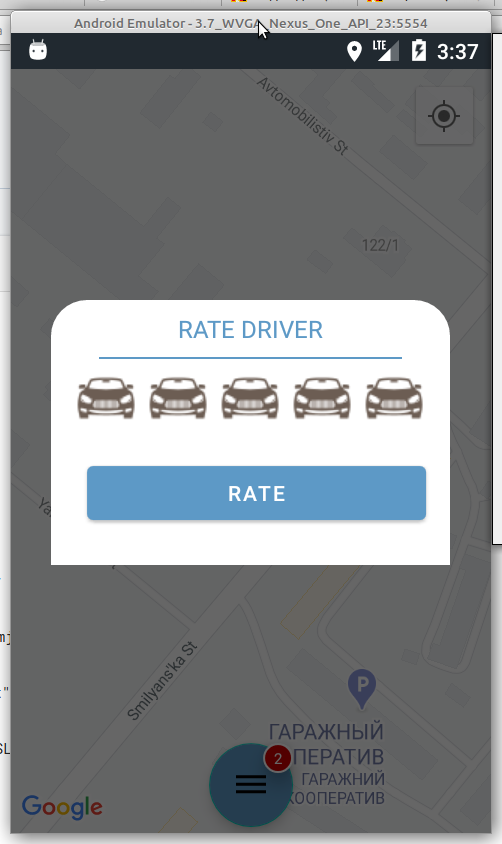

# geekhub2019
Cute Taxi
=========

The Taxi application with simple navigation

In app is used such libraries:
[DB Room][1],[Retrofit][2], [OkHttp][3], [Moshi][4], [MVVM-pattern][5];
and tests: [Espresso][6], [Mockito][7], Hamcrest, JUnit and other

Download
--------

  

Screens
-------

AUTHORIZATION

  
  

PASSENGER PART - ENTER ORDER DETAILS

  

SIDE NAVIGATION MENU

  

DRIVER PART - LIST OF NEW ORDERS

  

DRIVER PART - MAIN SCREEN

  

DRIVER PART - ORDER IN PROGRESS AND TWO NEW ORDERS

  

RATE

  

Authors
-------
Maksim Nakonechnyi - @gembrilus on GitHub

Yurii Burkut - @yuriy-burkut on GitHub

Camila Abalova - @Camila-1 on GitHub

License
-------
MIT. See the [LICENSE][8] file for details.

[1]: https://developer.android.com/topic/libraries/architecture/room
[2]: https://square.github.io/retrofit/
[3]: https://square.github.io/okhttp/
[4]: https://github.com/square/moshi
[5]: https://ru.wikipedia.org/wiki/Model-View-ViewModel
[6]: https://developer.android.com/training/testing/espresso
[7]: https://site.mockito.org/
[8]: https://github.com/gembrilus/CuteTaxi/blob/master/LICENSE
